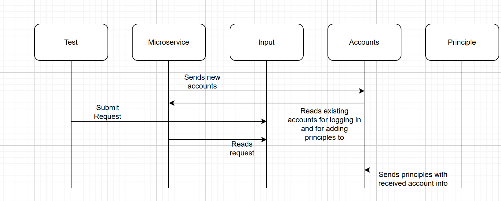

How to request data from the microservice: You will request all data from the microservice through text files. There are three possible calls where you write to the input file using commas as delimiters. 
For account creation use Name, Password, Bio, for account login use Name, Password, and for adding a principle use Name, Password, Name of Principle, Principle Explanation. 
Example calls are write(Name, Password, Bio), write(Name, Password), write(Name, Password, Name of Principle).

How to receive data from the microservice: You will receive all data from the microservice in text files. Have a text file called account.txt and principle.txt as this is where data will be written unless you change the file names in the code.
Example calls are open(account.txt, "r") and open(principle.txt, "r").

UML Diagram

